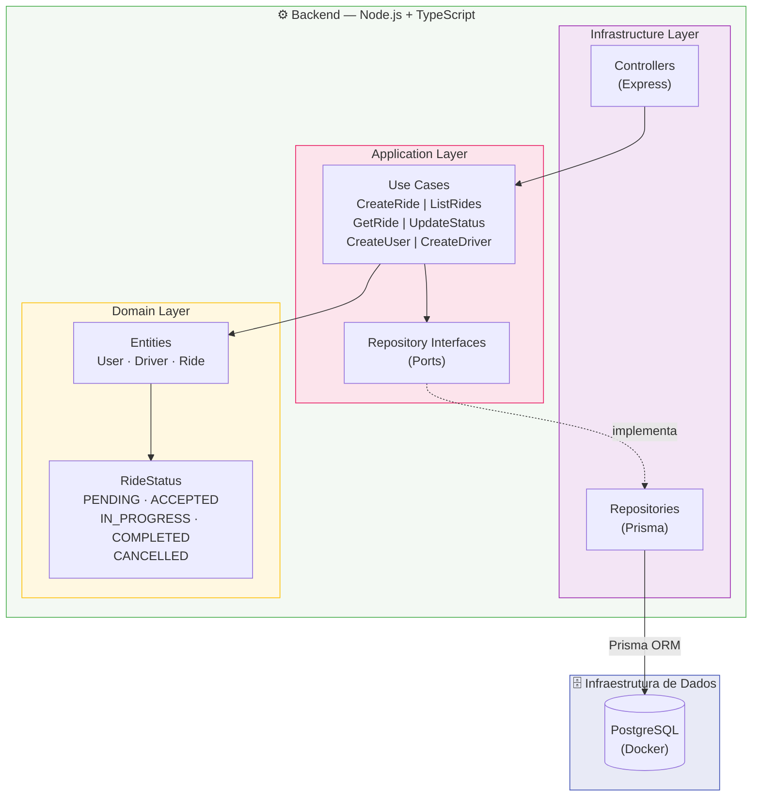

# Diagrama de Arquitetura — Sistema de Agendamento de Transporte

> Renderize este arquivo com a extensão **Mermaid Preview** no VSCode ou abra no GitHub.

## Descrição dos Componentes

| Componente | Tecnologia | Papel |
|---|---|---|
| Backend REST | Node.js + Express + TypeScript | Lógica de negócio, expõe API RESTful |
| ORM | Prisma | Acesso tipado ao banco de dados |
| Banco de Dados | PostgreSQL (Docker) | Persistência de dados |
