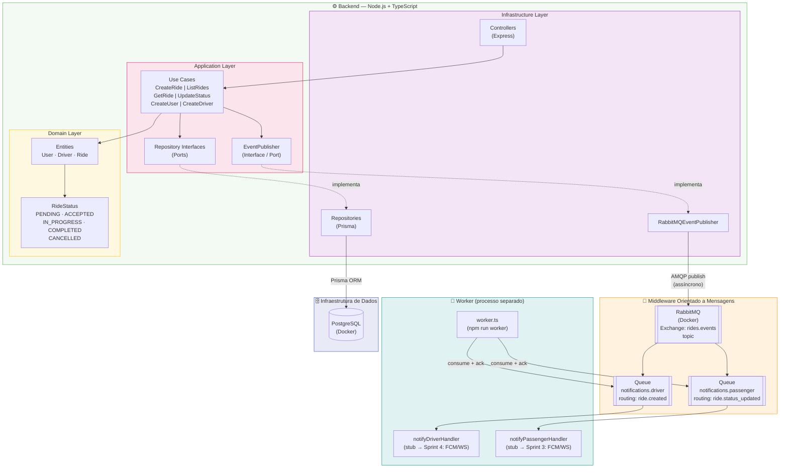

# Diagrama de Arquitetura — Sistema de Agendamento de Transporte

> Renderize este arquivo com a extensão **Mermaid Preview** no VSCode ou abra no GitHub.



## Descrição dos Componentes

| Componente | Tecnologia | Papel |
|---|---|---|
| Backend REST | Node.js + Express + TypeScript | Lógica de negócio, expõe API RESTful |
| ORM | Prisma | Acesso tipado ao banco de dados |
| Banco de Dados | PostgreSQL (Docker) | Persistência de dados |
| Message Broker | RabbitMQ 3.13 (Docker) | Exchange topic `rides.events`; garante entrega durável entre produtor e consumidor |
| Worker | Node.js (processo separado) | Consome filas `notifications.driver` e `notifications.passenger`; notifica apps móveis (stub em Sprint 2) |

## Fluxo de Eventos

```
POST /api/rides (HTTP síncrono)
  → CreateRideUseCase persiste no banco
  → publica "ride.created" em rides.events
  → retorna 201
         ↕ (assíncrono — sem REST entre backend e worker)
Worker consome notifications.driver
  → notifyDriverHandler loga notificação
  → ack

PATCH /api/rides/:id/status (HTTP síncrono)
  → UpdateRideStatusUseCase persiste no banco
  → publica "ride.status_updated" em rides.events
  → retorna 200
         ↕ (assíncrono)
Worker consome notifications.passenger
  → notifyPassengerHandler loga notificação
  → ack
```
