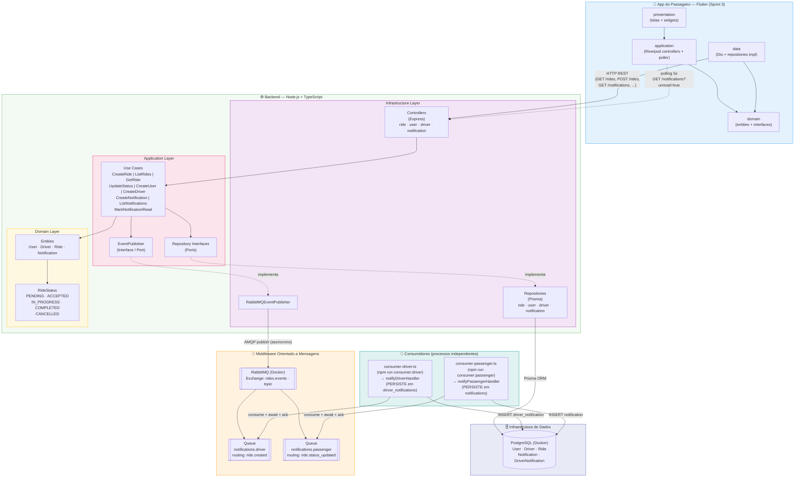
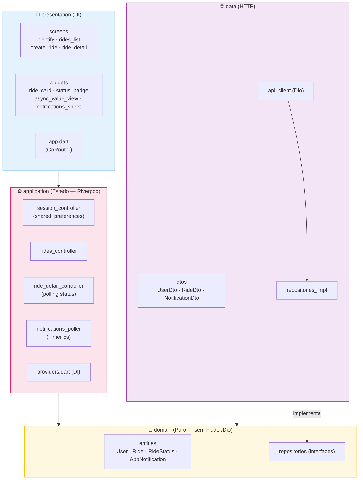

# Diagrama de Arquitetura — Sistema de Agendamento de Transporte

> Renderize este arquivo com a extensão **Mermaid Preview** no VSCode ou abra no GitHub.

## 1. Arquitetura Geral do Sistema (Sprints 1–3)



## 2. Camadas do App Flutter (Clean Architecture)



**Regra de dependência:** `presentation → application → domain` e `data → domain`. O `domain` não importa nada externo — espelha a filosofia do backend.

## Descrição dos Componentes

| Componente | Tecnologia | Papel |
|---|---|---|
| App do passageiro | Flutter/Dart + Riverpod | Cliente humano: identifica-se, solicita corridas, acompanha status em tempo quase-real via polling |
| Backend REST | Node.js + Express + TypeScript | Lógica de negócio, expõe API RESTful, produtor de eventos |
| ORM | Prisma | Acesso tipado ao banco de dados |
| Banco de Dados | PostgreSQL (Docker) | Persistência: User, Driver, Ride, Notification, DriverNotification |
| Message Broker | RabbitMQ 3.13 (Docker) | Exchange topic `rides.events`; entrega durável produtor → consumidor |
| consumer-driver | Node.js (processo independente) | Consome `notifications.driver` (`ride.created`); **persiste** linha em `driver_notifications` para o app do motorista fazer polling |
| consumer-passenger | Node.js (processo independente) | Consome `notifications.passenger` (`ride.status_updated`); **persiste** linha em `notifications` para o app fazer polling |

## Fluxo de Eventos + Atualização Assíncrona do App

```
POST /api/rides (HTTP síncrono)
  → CreateRideUseCase persiste no banco
  → publica "ride.created" em rides.events → retorna 201
         ↕ (assíncrono — sem REST entre backend e consumidor)
consumer-driver consome notifications.driver
  → notifyDriverHandler PERSISTE linha em driver_notifications
  → await antes do ack (nack em falha de banco)
         ↕
App do motorista faz polling GET /driver/notifications?unread=true (~5s)
  → detecta demanda nova → rebusca lista de corridas PENDING sem ação manual

PATCH /api/rides/:id/status (HTTP síncrono, driverId opcional)
  → UpdateRideStatusUseCase persiste no banco
  → publica "ride.status_updated" em rides.events → retorna 200
         ↕ (assíncrono)
consumer-passenger consome notifications.passenger
  → notifyPassengerHandler PERSISTE linha em notifications
  → await antes do ack (nack em falha de banco)
         ↕
App do passageiro faz polling GET /notifications?userId=X&unread=true (~5s)
  → detecta notificação nova → atualiza badge + rebusca lista/detalhe
  → UI reflete novo status SEM ação manual do usuário
```
