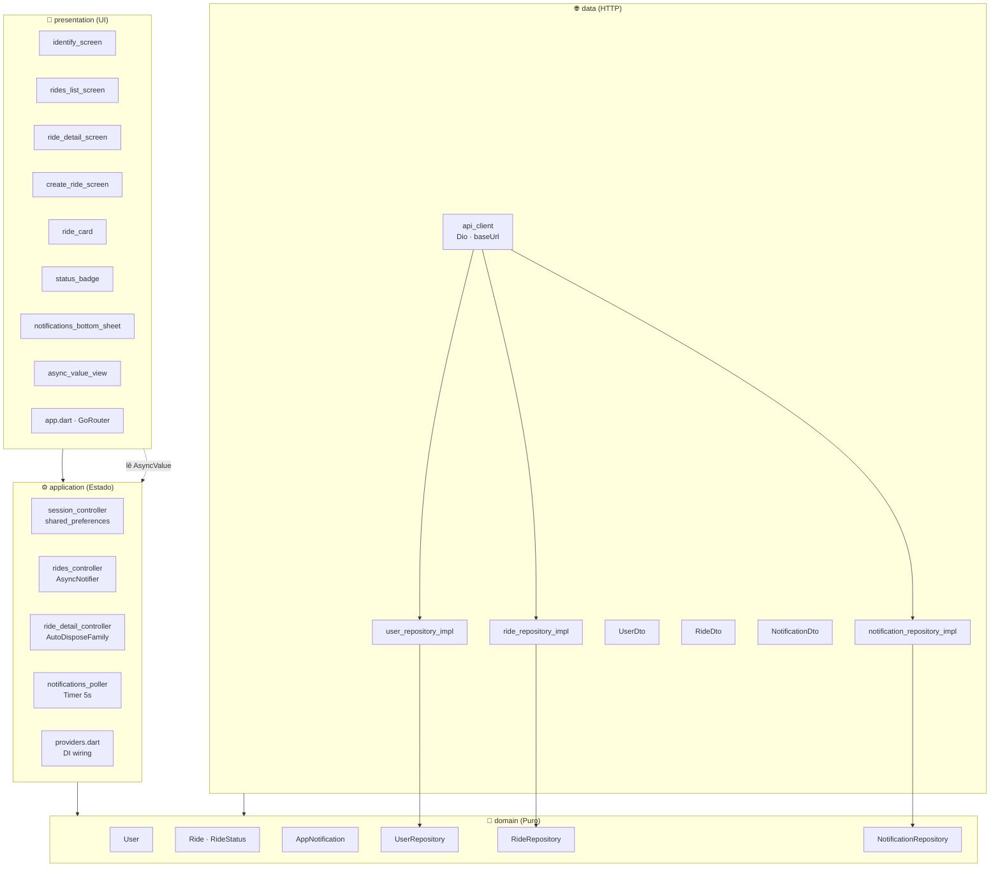
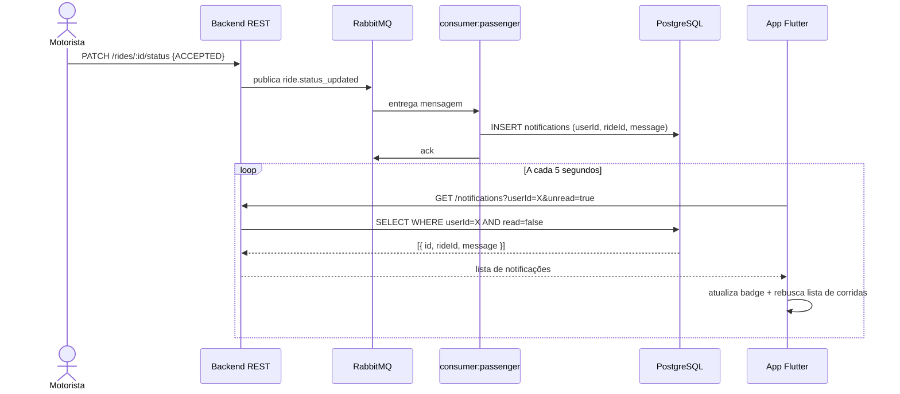

# Arquitetura do App do Passageiro — Sprint 3

## Visão Geral

O app segue **Clean Architecture** com quatro camadas concêntricas. A regra de dependência é unidirecional: camadas externas dependem de camadas internas; `domain` não importa nada externo (nem Flutter, nem Dio).

```
presentation → application → domain
data                       → domain
```

---

## Diagrama de Camadas



---

## Fluxo de Atualização Assíncrona



---

## Descrição das Camadas

### `domain/`
Entidades e contratos puros — sem dependência de Flutter, Dio ou qualquer framework.

| Arquivo | Conteúdo |
|---|---|
| `entities/user.dart` | `User` (id, name, email, phone) |
| `entities/ride.dart` | `Ride` + `enum RideStatus` com `fromString` e `isTerminal` |
| `entities/notification.dart` | `AppNotification` |
| `repositories/user_repository.dart` | Interface `UserRepository` |
| `repositories/ride_repository.dart` | Interface `RideRepository` |
| `repositories/notification_repository.dart` | Interface `NotificationRepository` |

### `data/`
Implementações concretas: serialização JSON ↔ entidade e chamadas HTTP via Dio.

| Arquivo | Responsabilidade |
|---|---|
| `datasources/api_client.dart` | Cria instância `Dio` com `baseUrl` configurável via `--dart-define` |
| `dtos/` | `UserDto`, `RideDto`, `NotificationDto` — `fromJson` + `toDomain()` |
| `repositories_impl/` | Implementações das interfaces do `domain` |

`baseUrl` padrão: `http://10.0.2.2:3000/api` (emulador Android → localhost do host).
Configurável via: `flutter run --dart-define=API_BASE_URL=http://192.168.x.x:3000/api`.

### `application/`
Estado gerenciado com **Riverpod 2.x**. Cada controller tem responsabilidade única.

| Provider | Tipo | Responsabilidade |
|---|---|---|
| `sessionControllerProvider` | `AsyncNotifier<String?>` | `userId` persistido via `shared_preferences` |
| `ridesControllerProvider` | `AsyncNotifier<List<Ride>>` | Lista de corridas do usuário logado |
| `rideDetailControllerProvider` | `AutoDisposeFamilyAsyncNotifier` | Corrida individual; polling de status |
| `notificationsPollerProvider` | `AsyncNotifier<List<AppNotification>>` | Polling a cada 5s, apenas não lidas |
| `allNotificationsProvider` | `FutureProvider.autoDispose` | Todas as notificações para exibição no painel |
| `unreadCountProvider` | `Provider<int>` | Contador derivado do poller |

### `presentation/`
Telas e widgets stateless/stateful. Dependem apenas de `application` via `ref.watch`.

| Tela | Função na rubrica |
|---|---|
| `identify_screen` | Cadastro leve (nome + email + telefone → `POST /users`) |
| `rides_list_screen` | **Tela de listagem** — `GET /rides?userId=X` + badge de notificações |
| `create_ride_screen` | **Tela de ação principal** — `POST /rides` |
| `ride_detail_screen` | **Tela de detalhes** — polling 5s, timeline de status, atualização automática |

---

## Regra de Dependência (resumo visual)

```
domain          ← nenhuma dependência externa
  ↑
data            ← depende de domain + Dio
  ↑
application     ← depende de domain + Riverpod
  ↑
presentation    ← depende de application + Flutter widgets
```
