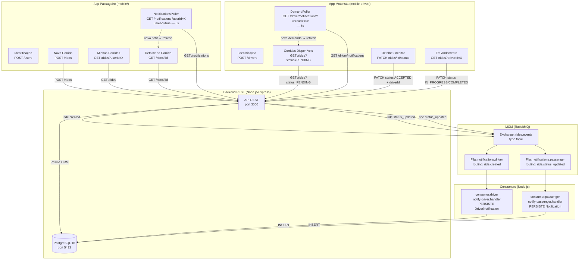
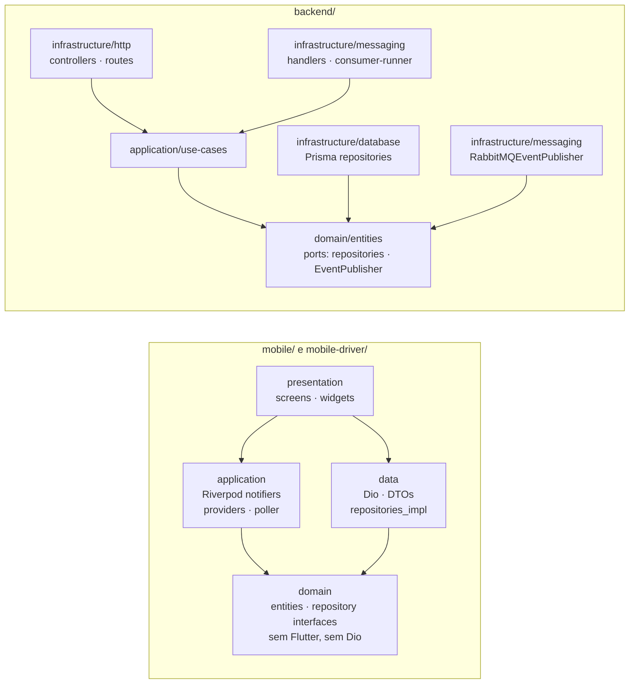

# Arquitetura Final — Fluxo Ponta-a-Ponta (Sprint 4)

> Diagrama e2e com os dois apps Flutter, backend e MOM.

## Diagrama de Componentes



## Fluxo e2e (narrativa)

```
1. Passageiro cria corrida
   POST /rides → backend persiste (PENDING) → publica ride.created no Exchange

2. consumer:driver consome ride.created
   → persiste DriverNotification (broadcast, sem driverId)

3. App do motorista (DemandPoller, 5s) detecta notificação nova
   → refresh automático da lista de corridas disponíveis
   → motorista vê a corrida SEM refresh manual  ← assincronicidade via MOM

4. Motorista abre o detalhe → Aceitar
   PATCH /rides/:id/status { status: "ACCEPTED", driverId }
   → backend persiste (ACCEPTED, driverId gravado) → publica ride.status_updated

5. consumer:passenger consome ride.status_updated
   → persiste Notification para o passageiro

6. App do passageiro (NotificationsPoller, 5s) detecta notificação nova
   → tela de detalhe muda para ACEITA SEM refresh manual  ← ponta-a-ponta completo

7. Motorista → Iniciar (IN_PROGRESS) → mesmo fluxo (passos 4–6)
8. Motorista → Concluir (COMPLETED) → mesmo fluxo (passos 4–6)
```

## Diagrama de Camadas (Clean Architecture — os dois apps)



## Tabela de Eventos (catálogo completo)

| Evento | Routing Key | Exchange | Produtor | Fila | Consumidor | Efeito |
|---|---|---|---|---|---|---|
| `ride.created` | `ride.created` | `rides.events` | `CreateRideUseCase` | `notifications.driver` | `consumer:driver` | Persiste `DriverNotification` (broadcast) |
| `ride.status_updated` | `ride.status_updated` | `rides.events` | `UpdateRideStatusUseCase` | `notifications.passenger` | `consumer:passenger` | Persiste `Notification` para o passageiro |
